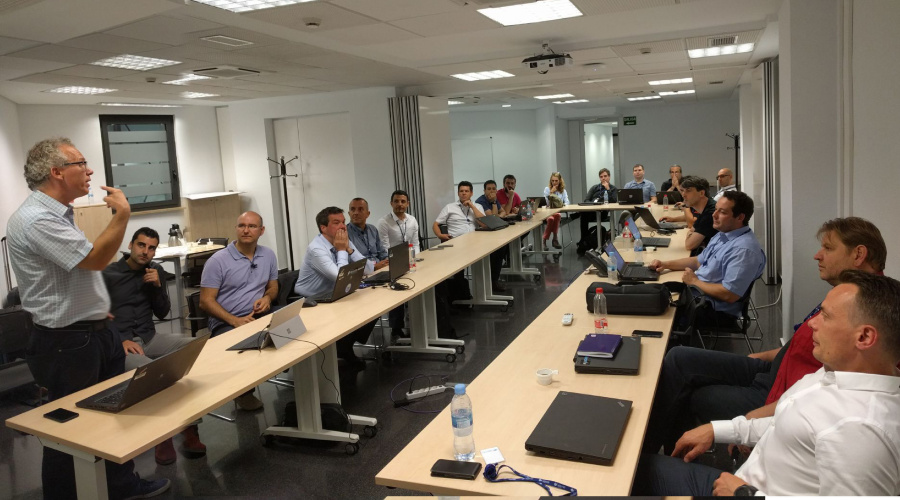

# we-dev-on newsletter; edition 7th of July 2017

  * [Introduction](#introduction)
  * [Devonfw Release notes 2.2 "Courage"](#devonfw-release-notes-22--courage-)
    + [Production Line Integration](#production-line-integration)
    + [OASP4js 2.0](#oasp4js-20)
    + [A new OASP Portal](#a-new-oasp-portal)
    + [New Cobigen](#new-cobigen)
    + [MyThaiStar: New Restaurant Example, reference implementation & Methodology showcase](#mythaistar--new-restaurant-example--reference-implementation---methodology-showcase)
    + [The new OASP Tutorial](#the-new-oasp-tutorial)
    + [OASP4j 2.4.0](#oasp4j-240)
    + [Microservices Netflix](#microservices-netflix)
    + [Devonfw distribution based on Eclipse OOMPH](#devonfw-distribution-based-on-eclipse-oomph)
    + [Visual Studio Code / Atom](#visual-studio-code---atom)
    + [More I18N options](#more-i18n-options)
    + [Spring Integration as devonfw Module](#spring-integration-as-devonfw-module)
    + [Devonfw Harvest contributions](#devonfw-harvest-contributions)
    + [More Deployment options to JEE Application Servers and Docker/CloudFoundry](#more-deployment-options-to-jee-application-servers-and-docker-cloudfoundry)
    + [Devcon on Linux](#devcon-on-linux)
    + [New OASP Incubators](#new-oasp-incubators)
  * [Combined devonfw and Production Line Design Authority meeting in Valencia](#combined-devonfw-and-production-line-design-authority-meeting-in-valencia)
  * [Contributors](#contributors)
  * [Colophon](#colophon)

<!-- i><a href='http://ecotrust-canada.github.io/markdown-toc/'>Table of contents generated with markdown-toc</a></i></small -->

## Introduction

Dear devonfw community,

We present the second edition of the 'we-dev-on' newsletter, the reader-supported publication for and from the devonfw & OASP communities all over Capgemini APPS2. This does not mean that the newsletter has any fixed schedule. There is no rush - we publish when ready - but we are happy to conclude and to report that there are enough new news items which warrant this new edition.

The iCSD Core Team

## Devonfw Release notes 2.2 "Courage"

We are proud to present the new release of Devonfw, version “2.2” which we've baptized “Courage”. 

Major focus of this release was achieve more integration between devonfw and the Production Line. Further more, a major milestone is the integration of OASP4js, which is based on Angular 4. But as this edition of _we-dev-on_ shows, there is a whole range of improvements and new features available in this release.

### Production Line Integration

Devonfw is now fully supported on the Production Line v1.3 and the coming v2.0. Besides that, we now "eat our own dogfood" as the whole devonfw project, all "buildable assets", now run on the Production Line.

### OASP4js 2.0

The main focus of the Courage release is the renewed introduction of "OASP for JavaScript", or OASP4js. This new version is a completely new implementation based on Angular (version 4). This new "stack" comes with:

- New application templates for Angular 4 application (as well as Ionic 3)

- A new reference application

- A new tutorial (and Architecture Guide following soon)

- Component Gallery

- New Cobigen templates for generation of both Angular 4 and Ionic 3 UI components ("screens")

- Integration of Covalent and Bootstrap offering a large number of components

- my-thai-star, a showcase and reference implementation in Angular of a real, responsive usable app using recommended architecture and patterns

- A new Tutorial using my-thai-star as a starting point

See:

[https://github.com/oasp/oasp4js-application-template](https://github.com/oasp/oasp4js-application-template)

[https://github.com/oasp/oasp4js-angular-catalog](https://github.com/oasp/oasp4js-angular-catalog)

[https://github.com/oasp/my-thai-star/tree/develop/angular](https://github.com/oasp/my-thai-star/tree/develop/angular)

### A new OASP Portal

As part of the new framework(s) we have also done a complete redesign of the OASP Portal website at [http://oasp.io/](http://oasp.io/) which should make all things related with OASP more accessible and easier to find.

### New Cobigen

Major changes in this release:

- Support for multi-module projects

- Client UI Generation:

  - New Angular 4 templates based on the latest - angular project seed

  - Basic Typescript Merger

  - Basic Angular Template Merger

  - JSON Merger

- Refactored oasp4j templates to make use of Java template logic feature

- Bugfixes:

  - Fixed merging of nested Java annotations including array values
  - more minor issues

- Under the hood:

  - Large refactoring steps towards language agnostic templates formatting sensitive placeholder descriptions automatically formatting camelCase to TrainCase to snake-case, etc.

- Easy setup of CobiGen IDE to enable fluent contribution

- CI integration improved to integrate with GitHub for more valuable feedback

See: [https://github.com/devonfw/tools-cobigen/releases](https://github.com/devonfw/tools-cobigen/releases)

### MyThaiStar: New Restaurant Example, reference implementation & Methodology showcase

A major part of the new devonfw release is the incorporation of a new application, "my-thai-star" which among others:

- serve as an example of how to make a "real" devonfw application (i.e. the application could be used for real)

- Serves  as an attractive showcase

- Serves as a reference application of devonfw patterns and practices as well as the standard example in the new devonfw tutorial

- highlights modern security option like JWT Integration

The application is  accompanied by a substantial new documentation asset, the devonfw methodology, which described in detail the whole lifecycle of the development of a devonfw application, from requirements gathering to technical design. Officially my-that-star is still considered to be an incubator as especially this last part is still not as mature as it could be. But the example application and tutorial are 100% complete and functional and form a marked improvement over the "old" restaurant example app. My-Thai-star will become the standard example app from devonfw 3.0 onwards. 

See:

[https://github.com/oasp/my-thai-star](https://github.com/oasp/my-thai-star)

[https://github.com/oasp/my-thai-star/wiki](https://github.com/oasp/my-thai-star/wiki)

### The new OASP Tutorial

The OASP Tutorial is a new part of the combined OASP / devonfw documentation which changes the focus of how people can get started with the platform

There are tutorials for OASP4j, OASP4js (Angular), OASP4fn and more to come. My-Thai-Star is used throughout the tutorial series to demonstrate the basic principles, architecture, and good practices of the different OASP "stacks". There is an elaborated exercise where the readers get to write their own application "JumpTheQueue". 

We hope that the new tutorial offers a better, more efficient way for people to get started with devonfw. Answering especially the question: how to make a devonfw application.

Oasp4j tutorial: [https://github.com/oasp/oasp-tutorial-sources/wiki/OASP4jGettingStartedHome](https://github.com/oasp/oasp-tutorial-sources/wiki/OASP4jGettingStartedHome)

Oasp4js tutorial: [https://github.com/oasp/oasp-tutorial-sources/wiki/OASP4jsGettingStartedHome](https://github.com/oasp/oasp-tutorial-sources/wiki/OASP4jsGettingStartedHome)

Oasp4fn tutorial: [https://github.com/oasp/oasp-tutorial-sources/wiki/OASP4FnGettingStartedHome](https://github.com/oasp/oasp-tutorial-sources/wiki/OASP4FnGettingStartedHome)

### OASP4j 2.4.0

"OASP for Java" or OASP4j now includes updated versions of the latest stable versions of Spring Boot and the Spring Framework and all related dependencies. This allows guaranteed, stable, execution of any devonfw 2.X application on the latest versions of the Industry Standard Spring stack. 
Another important new feature is a new testing architecture/infrastructure. All database options are updated to the latest versions as well as guaranteed to function on all Application Servers which should cause less friction and configuration time when starting a new OASP4j project. 

Details:

- Spring Boot Upgrade to 1.5.3

- Updated all underlying dependencies

- Spring version is 4.3.8

- Exclude Third Party Libraries that are not needed from sample restaurant application

- Bugfix:Fixed the 'WhiteLabel' error received when tried to login to the sample restaurant application that is deployed onto external Tomcat

- Bugfix:Removed the API api.org.apache.catalina.filters.SetCharacterEncodingFilter and used spring framework's API org.springframework.web.filter.CharacterEncodingFilter instead

- Bugfix:Fixed the error "class file for javax.interceptor.InterceptorBinding not found" received when executing the command 'mvn site' when trying to generate javadoc using Maven javadoc plugin

- Removed the deprecated API io.oasp.module.web.common.base.PropertiesWebApplicationContextInitializer

- Documentation of the usage of UserDetailsService of Spring Security

See: https://github.com/oasp/oasp4j

Wiki: https://github.com/oasp/oasp4j/wiki

### Microservices Netflix

Devonfw now includes a microservices implementation based on Spring Cloud Netflix. It provides a Netflix OSS integrations for Spring Boot apps through autoconfiguration and binding to the Spring Environment. It  offers microservices archetypes and a complete user guide with all the details to start creating microservices with Devonfw.

See: [https://github.com/devonfw/devon/wiki/devon-microservices](https://github.com/devonfw/devon/wiki/devon-microservices)

### Devonfw distribution based on Eclipse OOMPH

The new Eclipse devonfw distribution is now based on Eclipse OOMPH, which allows us, an any engagement, to create and manage the distribution more effectively by formalizing the setup instructions so they can be performed automatically (due to a blocking issue postponed to devonfw 2.2.1 which will be released a few weeks after 2.2.0)

### Visual Studio Code / Atom

The devonfw distro now contains Visual Studio Code alongside Eclipse in order to provide a default, state of the art, environment for web based development.

See: [https://github.com/oasp/oasp-vscode-ide](https://github.com/oasp/oasp-vscode-ide)

### More I18N options

The platform now contains more documentation and a conversion utility which makes it easier to share i18n resource files between the different frameworks.

See: [https://github.com/devonfw/devon/wiki/cookbook-i18n-resource-converter](https://github.com/devonfw/devon/wiki/cookbook-i18n-resource-converter)

### Spring Integration as devonfw Module

This release includes a new module based on the Java Message Service (JMS) and Spring Integration which provides a communication system (sender/subscriber) out-of-the-box with simple channels (only to send and read messages), request and reply channels (to send messages and responses) and request & reply asynchronously channels.

See: [https://github.com/devonfw/devon/wiki/cookbook-integration-module](https://github.com/devonfw/devon/wiki/cookbook-integration-module)

### Devonfw Harvest contributions

Devonfw contains a whole series of new components obtained through the Harvesting process. Examples are:

- New backend IP module Compose for Redis: management component for cloud environments. Redis is an open-source, blazingly fast, key/value low maintenance store. Compose's platform gives you a configuration pre-tuned for high availability and locked down with additional security features. The component will manage the service connection and the main methods to manage the key/values on the storage. The library used is "lettuce".

- Sencha component for extending GMapPanel with the following functionality :
  - Markers management
  - Google Maps options management
  - Geoposition management
  - Search address and coordinates management
  - Map events management
  - Map life cycle and behavior management

- Sencha responsive Footer that moves from horizontal to vertical layout depending on the screen resolution or the device type. It is a simple functionality but we consider it very useful and reusable.

See: [https://github.com/devonfw/devon/wiki/cookbook-compose-for-redis-module](https://github.com/devonfw/devon/wiki/cookbook-compose-for-redis-module)

### More Deployment options to JEE Application Servers and Docker/CloudFoundry

The platform now fully supports deployment on the latest version of Weblogic, Websphere, Wildfly (JBoss) as well as Docker and Cloudfoundtry

See:

[https://github.com/devonfw/devon/wiki/Deployment-on-WebLogic](https://github.com/devonfw/devon/wiki/Deployment-on-WebLogic)

[https://github.com/devonfw/devon/wiki/cookbook-Deployment-on-WebSphere](https://github.com/devonfw/devon/wiki/cookbook-Deployment-on-WebSphere)

[https://github.com/devonfw/devon/wiki/cookbook-Deployment-on-Wildfly](https://github.com/devonfw/devon/wiki/cookbook-Deployment-on-Wildfly)

### Devcon on Linux

Devcon is now fully supported on Linux which, together with the devonfw distro running on Linux, makes devonfw fully multi-platform and Cloud compatible (as Linux is the default OS in the Cloud!)

See: [https://github.com/devonfw/devcon/releases](https://github.com/devonfw/devcon/releases)

### New OASP Incubators

From different Business Units (countries) have contributed "incubator" frameworks:

- OASP4NET (Stack based on .NET Core / .NET "Classic" (4.6))
- OASP4X (Stack based on Xamarin) 
- OASP4Fn (Stack based on Node-js/Serverless): [https://github.com/oasp/oasp4fn](https://github.com/oasp/oasp4fn)

An "incubator" status means that the frameworks are production ready, all are actually already used in production, but  are still not fully compliant with the OASP definition of a "Minimally Viable Product".

During this summer the OASP4NET and OASP4X repos will be properly installed. In the mean time, if you want to have access to the source code, please contact the _Devonfw Core Team_.

## Combined devonfw and Production Line Design Authority meeting in Valencia

Wednesday the 5th of July to Friday 7th of July 2017 the combined devonfw and Production Line Design Authority metup at the officees of Capgemini Valencia. 

Recap: expect more community work and collaboration between both lines of work from now on. The roadmap contains continuing integration and more focus on testing. In the next week we will publish the meeting minutes and the slide decks used during the seminars.

Great to have you all here in Valencia!

## Contributors

Many thanks to all who made this release possible!

## Colophon

we-dev-on is a reader-supported publication dedicated to producing the best coverage of project info, opinions, news, events, tips & tricks from within the devonfw & OASP communities all over Capgemini APPS2.

Copyright © 2017 Capgemini
Licensed under the Apache License, Version 2.0
