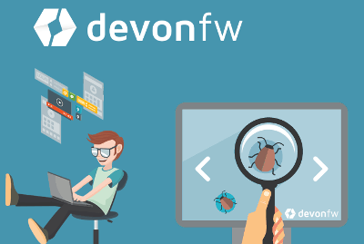
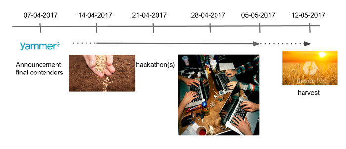
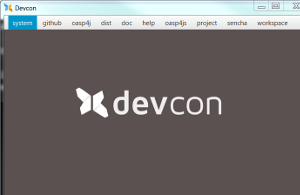
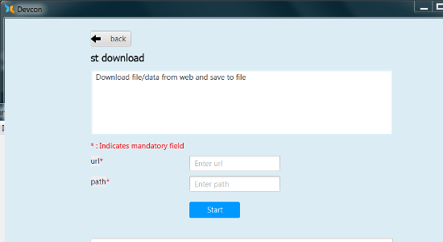
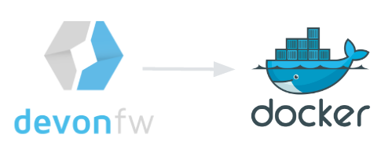

# we-dev-on Newsletter edition 10th of March 2017


> TODO: SPELL CHECK & GENERAL EDITING

## Introduction

@Thorsten: something like "...Welcome to the first edition of the iCSD News Letter 'we-dev-on'. This is a reader-supported publication dedicated to producing the best coverage of news, events, tips & tricks from within the devonfw & OASP communities all over Capgemini APPS2..."

## Webcasts "iCSD - Stuff That Matters"

This year we have started with a new webcast series for you, called "iCSD - Stuff That Matters" (thanks to Maurice Driessen for the great name). The idea is to organize webcasts dealing with topics which seem relevant for the community related with devonfw and OASP4j. Each session is planned for half an hour up to an hour with reserved time for Q&A. There, you will be able to ask anything related to the topic or iCSD in general.



We started with a highly attended first session the 27th of January 2017 by Angel Marin from Capgemini Spain (Valencia) about "Dealing with Complexity on the Front End". Angel took a look at one of our front-end options provided by devonfw: Devon4sencha. This framework is based on Sencha, a powerful JavaScript framework for creating rich web applications. He showed how it makes it easy to deal with usually complex user interface patterns and during the session he explored some of the tools it provides. There was time for Q&A and we are happy people did not hesitate to ask anything that came to their mind.

A second session was held the 24th of February by Jonas Molina Ramirez from Capgemini Germany (Frankfurt) about "Testing with OASP4j". During his his talk Jonas investigated the testing facilities currently provided by OASP4j and he showed those features which aid you with the following:

- Focus on test logic instead of infrastructure
- Manage your test data
- Configure your tests

The edited video of this talk has been uploaded to Teamforge and [can be found in the Server section](https://coconet.capgemini.com/sf/frs/do/viewRelease/projects.apps2_devon/frs.videos.devon_server?_message=1488358284665). It will be included soon in the devonfw Catalog in the 360 learning platform.

The third episode, planned for end of March / beginning of April, will deal with the ins and outs of Cobigen, the code generator in devonfw.
The Webcasts are definitely meant to be open. So, as always, you are very welcome to propose certain topics and / or present a topic yourself.

## Devonfw Harvest

Everyone agrees that apart from a strong architecture framework an essential asset is to provide a large component library or module catalogue. This also plays an essential part within that principal goal of devonfw: avoiding that we reinvent the wheel time and time again. However, there is not enough budget available to create a fully featured component catalgoue and often a fully developed component is out of scope of what an individual member of the community would be able to contribute. Ideally, the engagements would contribute to the catalogue but often there is junst not engough time or resources available within the scope of the engagement.


In order solve this persistent problem we propose the **devonfw Harvest**.

This is meant to be an agile process wherin the engagement do not have to change their client focused aproach. They implement their modules and components in the interest of and within the context of the project. However, we offer them the opportunity to contribute their work within devonfw by participating in "the Harvest". During these events, basically hackathons, members of the devonfw and OASP communities help volunteers from the engagements "extract" project specific components and turn them into more generic modules which can be used by any future engagement from all over APPS2. By participating in a Harvest, the engeagements can contribute back and contribute to the common good. And as a teaser we offer a price for the best component for each Harvest. This, and everlasting fame, of course.

A Harvest begins with the anouncement in Yammer, this newsletter and other channels. Engagements can put forward one or multiple modules, let´s call them "seedlings", each with a corresponding team which will be responsible for the actual Harvesting. After a few weeks a jury from the Architect Community will select the teams eligble to participate in the Harvest and will assign a volunteer member of the Communiity as mentor to each team. In the next 5 weeks each Friday during hackathon sessions, these teams with their assigned mentors and volunteers from the community will work on Harvesting these components.

The actual dates and time in reality are not prescribed at all. The teams can pick and choose the moment when they want to work togehter. But we will reserve one hour at these Fridays where during a Skype session each team can present their work and report about the status. At the fith and last session the Architect Community will anounce the winner and in the weeks afterwards we will higlight each and every harvested module in this newslettter or separate webcasts (iCSD Stuff That Matters).

From today onwards engagements can put forward their candidate compoment and teams. We will repeat this anouncement various times during the next week. Participating is as simple as posting such an anouncment in the Devonfw group in Yammer.



Friday the 7th of April the eligible contenders are announceed in Yammer. During the next 5 consequetive Fridays we will organize the webcast where all teams can show off theor work. And Friday the 12th of May 2017 the winning team will be anounced.

Every component and contribution, every bit of help, large or small, is very welcome. So let start seeding and work towards a rich Harvest!

## Devcon command developers guide

The Devon Console, Devcon, is a cross-platform command line tool running on the JVM that provides many automated tasks around the full life-cycle of Devon applications, from installing the basic working environment and generating a new project, to running a test server and deploying an application to production. Devcon is the easiest way to use Devonfw. By accompanying on project automation, easy command execution and declarative configuration, it gets out of your way and let you focus on your code.



In latest versions we have added the possibility to create and integrate your own scripts very easily. In the current version we support JavaScript which is executed by Nashorn, the JavaScript interpreter included in Java 8 (so out of necessity we do not support Java 7 for this feature). From within the script you can easily access the whole Java API, modules loaded in the CLASSPATH and even external JavaScript modules can be loaded. For example, to load the popular library LoDash you can include the following code fragment:

```javascript
load("https://raw.github.com/lodash/lodash/3.10.1/lodash.js")  // load lodash from its Github repo
_.map([1, 2, 3], function(n) { return n * 3; });  // just an exmpke of course
```

By using JavaScript your team will be able to easily integrate external tools and common utilities within an unified tool chain. For example the following example shows how it is possible to easily create a generic command to download a file using the native Java API.

```javascript
function(url, path){
    var Files = Java.type("java.nio.file.Files")
    var URL = Java.type("java.net.URL")
    var Paths = Java.type("java.net.Paths")
    var website = new URL(url) // i.e. "http://devonfw.com"
    var _is = website.openStream()
    Files.copy(_is, Paths.get(path))  // i.e. "output.txt"
}
```

So when choosing the option in the menu, you can fill in the parameters in Devcon in the following manner:



Just press "start" and the web page or file is downloaded and saved to the specified path.

All the details about how to incorporate your engagement specific and your own JavaScript functions within Devcon you can find in the Devcon Command Developers Guide (see down).

### Links

- [Oracle Nashorn: A Next-Generation JavaScript Engine for the JVM](http://www.oracle.com/technetwork/articles/java/jf14-nashorn-2126515.html)
- [devcon command developers guide](https://github.com/devonfw/devon-guide/wiki/devcon-command-developers-guide)

## devonfw on Docker

What if we could create, test and even implement distributed Devon applications inside of software containers like Docker? What if we could guarantee that our apps will run in the Cloud as well as locally?

Those questions are currently finding their answers. The Devonfw Core Team is currently working on some fancy **Docker** features for Devon projects. Imagine having an already prepared _dockerized_ project, which can be "containerized" just by following few steps, or even by executing a script. How cool is that?

A next step would be extending the containers with more advanced features. These could distributively run in a cloud, and even having some different replicas depending on where in the world they are being accessed from.



Right now, all Docker files we are developing are stored in [the Devonfw-on-Docker repository](https://github.com/devonfw/devonfw-on-docker/). Besides, there is a [Gitter room](https://gitter.im/devonfw/devonfw-on-docker?utm_source=share-link&utm_medium=link&utm_campaign=share-link) where you can ask about how we do it, the development itself or even suggest more features (be aware that the Gitter room is provisional, i.e. an experiment, and is **not** guaranteed to exist in the long term; use Yammer instead for a more persistent forum).

## Spring Integration Devonfw Module

The Enterprise Integration consist on connect or communicate different systems (apps) in a reliable and loosely coupled way. It can sometimes be tricky, despite there are libraries and tools that facilitate the configuration. But the developers usually have to deal with complex _Bean_ configurations (through _xml_) and concepts like _gateways_, _channels_, _inbound_ and _outbound_ adapters, etc. and these concept may not always be clear.


For that reason we are developing a new IP module, to be included in next release, that makes the Integration between apps really easy. Based on the _Java Message Service_ (JMS) and _Spring Integration_ the Devonfw _Integration module_ provides a communication system (sender/subscriber) out-of-the-box with simple channels (only to send and read messages), request & reply channels (to send messages and responses) and request & reply asynchronously channels. To enable one of these channels the user only need to set a property in the `application.properties` file and the module does all the configuration job. After doing this, the usage is also really simple:

To send a message
```java
integration.send("hello");
```
Or to start receiving messages from a channel

```java
integration.subscribe(myMessageHandler);
```

In addition, you can also create, programmatically and with a very simple API, new channels with customized configuration.

You can find more details about the implementation in the [Devonfw guide](https://github.com/devonfw/devon-guide/wiki/cookbook-integration-module). The module is already available cloning the [devon](https://github.com/devonfw/devon) repository.

## More Hip & interesting things

XXX

## Tips and tricks

### ps-console

Did you know that in the root of the devonfw distribution you can find the file *ps-console.bat*. Starting this shell will open a devonfw prompt in PowerShell. With all paths set to the devonfw environment and corresponding programs within the distribution (Eclipse, npm, Sencha etc). PowerShell is a task automation and configuration management framework from Microsoft, consisting of a command-line shell and associated scripting language built on the .NET Framework. Working with PowerShell is a breath of fresh air compared with the ancient CMD.exe. It is a bit of a deep dive, but you will be hooked after after you have tasted it once. See: [Microsoft PowerShell](https://msdn.microsoft.com/en-us/powershell).

### Mocking with Simlets in Sencha Ext JS

Did you now that Sencha Ext JS provides a utility to simulate server responses to any request, right in the browser? Generally, these utilities are called simlets. Through simlets it is possible to to mock an entire server or even a part of it. Sencha out-of-box provides an XML and JSON type of AJAX simlets, base classes are available to extend and create new ones that support other type of requests or envelopes, such as multipart/form-data or remote procedure calls. For more information [check out the Devonfw Guide](https://github.com/devonfw/devon-guide/wiki/Client-GUI-Sencha-Simlets-Simulate-Server-Responses#mocks-with-simlets-simulating-server-responses).

## Contributors

TODO only add real contributors to this issue

Many thanks to adrianbielewicz, aferre777, amarinso, arenstedt, azzigeorge, cbeldacap, cmammado, crisjdiaz, csiwiak, Dalgar, drhoet, Drophoff, dumbNickname, EastWindShak, fawinter, fbougeno, fkreis, GawandeKunal, henning-cg, hennk, hohwille, ivanderk, jarek-jpa, jart, jensbartelheimer, jhcore, jkokoszk, julianmetzler, kalmuczakm, kiran-vadla, kowalj, lgoerlach, ManjiriBirajdar, MarcoRose, maybeec, mmatczak, nelooo, oelsabba, pablo-parra, patrhel, pawelkorzeniowski, PriyankaBelorkar, RobertoGM, sekaiser, sesslinger, SimonHuber, sjimenez77, sobkowiak, sroeger, ssarmokadam, subashbasnet, szendo, tbialecki, thoptr, tsowada, znazir and anyone who we may have forgotten to add!

## Colophon

we-dev-on is a reader-supported publication dedicated to producing the best coverage of news, events, tips & tricks from within the devonfw & OASP communities all over Capgemini APPS2.

Copyright © 2017 Capgemini