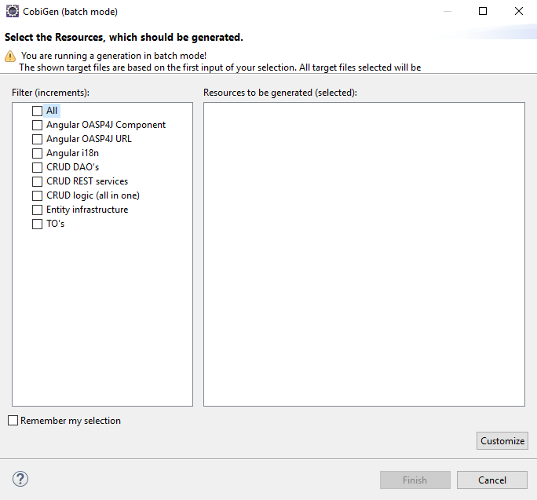

# we-dev-on newsletter; edition 15th of November 2017

  * [Introduction](#introduction)
  * [CobiGen 3.0.0](#cobigen-300)
  * [CobiGen: Now with Swagger / OpenApi 3.0 support](#cobigen--now-with-swagger---openapi-30-support)
  * [What is Swagger?](#what-is-swagger-)
  * [How does it work?](#how-does-it-work-)
  * [Writing the Swagger File](#writing-the-swagger-file)
  * [Run your Angular OASP4JS application as a PWA](#run-your-angular-oasp4js-application-as-a-pwa)
  * [Contributors](#contributors)
  * [Colophon](#colophon)

<small><i><a href='http://ecotrust-canada.github.io/markdown-toc/'>Table of contents generated with markdown-toc</a></i></small>

<!-- i><a href='http://ecotrust-canada.github.io/markdown-toc/'>Table of contents generated with markdown-toc</a></i></small -->


## Introduction

Dear devonfw community,

We present the ffith edition of the ‘we-dev-on’ newsletter, the reader-supported publication for and from the devonfw & OASP communities all over Capgemini APPS2. This edition covers the latest release of Cobigen, version 3, with a deep dive of it´s new capabilty to generate code based on OpenAPI (aka "Swagger"). Further more we focus on running your Angular/OASP4js applicaton as a _Progressive Web Apps_ (PWA).

The iCSD Core Team

## CobiGen 3.0.0

CobiGen has evolved over the last months a lot. Several new plug-ins now support merging of JSON, Angular Html snippets, and TypeScript. We even enabled the use of different template languages as some of you prefer to use Velocity rather than FreeMarker. There you go!

The new demand of maintaining more than 10 plug-ins finally caused a huge amount of time to transport a bugfix to the user. Therefore, enabled the support of the already existing modularity on Java level also for the eclipse world as well as the maven world. Bugfixes can now be immediately released and used by anyone no matter in which plug-in the bug is located.

*What you might not have seen so far?*

* [cobigen.properties](https://github.com/devonfw/tools-cobigen/wiki/cobigen-core_configuration#template-properties): Specify static properties to be used within your properties and thus configure your generation on a project basis
* [Multi-module support](https://github.com/devonfw/tools-cobigen/wiki/cobigen-core_configuration#multi-module-support-or-template-target-path-redirects): redirect the target path of your templates by setting the `relocate` property in any `cobigen.properties`
* [Change the template engine](https://github.com/devonfw/tools-cobigen/wiki/cobigen-core_configuration#templates-configuration): You can change the template engine per templates configuration (`templates.xml`). Currently, there are plug-ins for [FreeMarker](http://freemarker.org/) and [Velocity](http://velocity.apache.org/).

## CobiGen: Now with Swagger / OpenApi 3.0 support

CobiGen is a tool that is constantly evolving. Until now, CobiGen was based on a "code first" generation, that means that every generation needed a previous Java or XML file as input to the generation to start.
On this last version, a new plug-in for Swagger 3.0 is added, enabling the "contract first" generation using a Swagger file that follows the OpenApi 3.0 standard.
 
## What is Swagger?

Swagger is a framework for describing your API using a common language that everyone can understand. That way you can define entities, the relationships that these entities must have, services with defined http requests types, etc... .

In conclusion:

- It's understandable for developers and non-developers. Product managers, partners, and even potential clients can have input into the design of your API, because they can see it clearly mapped out in this friendly UI.
- It's human readable and machine readable. This means that not only can this be shared with your team internally, but the same documentation can be used to automate API-dependent processes.
- It's easily adjustable. This makes it great for testing and debugging API problems.

Swagger Example - [Pet Store](http://petstore.swagger.io/#/)

## How does it work?

Just put your Swagger definition file into the core folder of your OASP4J project and use CobiGen from it. You can generate all the layers of the OASP4J back-end (dataacces, logic and service) in just one single generation, including the defined custom operations. Also, at the same generation, you can generate an Angular4+ front-end.



## Writing the Swagger File

To be compatible with CobiGen and OASP4J, the Swagger file must follow some specific configurations. This configurations also allows to avoid redundant definitions as SearchCriterias and PaginatedList objects used at the services definitions.
Just adding the _tags_ property at the end of the service definitions with the items _SearchCriteria_ and/or _paginated_ put into CobiGen knowledge that an standard OASP4J SearchCriteria and/or PaginateListTo object must be generated. That way, the Swagger file will be easier to write and even more understandable.

```yaml
  /sampledatamanagement/v1/sampledata/customSearch/:
    post:
      summary: 'Delegates to {@link Sampledatamanagement#findSampleDataEtos}.'
      description: Return SampleData that fits the filter.
      operationId: findCustomSampleDataEtos
      responses:
        '200':
          description: List of SampleData's.
          content:
            application/json:
              schema:
                type: array
                items:
                  $ref: '#/components/schemas/SampleData'
      requestBody:
        $ref: '#/components/requestBodies/SampleData'
      tags:
        - searchCriteria
        - paginated
```

Same criteria is followed for the relationships. Adding the extended properties to the schema definitions allows the definitions of unidirectional and bidirectional relationships:

- x-onetoone
- x-manytoone
- x-onetomany
- x-manytomany

```yaml
SampleData:
      x-component: sampledatamanagement
      type: object
      properties:
        name:
          type: string
          maxLength: 100
          minLength: 0
          description: Name string.
        surname:
          type: string
          description: Surname string.
        age:
          type: integer
          format: int32
          description: Age integer.
        mail:
          type: string
          description: Mail string.
      x-onetomany: MoreData
MoreData:
      x-component: moredatamanagement
      type: object
      properties:
        example:
          type: string
      x-manytoone: SampleData
```

Is important to underline that, the Swagger file must follow the OpenAPI 3.0 specifications.
## Run your Angular OASP4JS application as a PWA

The following steps will let you run your current application as a PWA. There is much more room for improvement, but as an initial approach is quite easy to make and test. 
 
### What is PWA?


PWA or _Progressive Web Apps_ is a new standard in web development. According to [Google](https://developers.google.com/web/progressive-web-apps/):

Progressive Web Apps are user experiences that have the reach of the web, and are:

- **Reliable** - Load instantly and never show the [downasaur](https://www.google.com/search?q=downasaur&source=lnms&tbm=isch&sa=X&ved=0ahUKEwiTkvz3h77XAhVHIMAKHcFWCmUQ_AUICigB&biw=1536&bih=734), even in uncertain network conditions.
- **Fast** - Respond quickly to user interactions with silky smooth animations and no janky scrolling.
- **Engaging** - Feel like a natural app on the device, with an immersive user experience.

Apart from these characteristics, PWAs are usually responsive and should adopt to most devices and screen sizes. They are installable on mobile devices, meaning you can have a link on your home screen to launch the app right away making it *easier to access*. And they work in all web browsers. In modern browsers, we will leverage the amazing APIs we will talk about later, but in older browsers, our app should still work perfectly fine, without the amazing modern stuff of course.

### Instructions

We suppose that we have a recent **Angular 4+** application that works fine. This application was initially created using the [Angular CLI](https://cli.angular.io/) following the latest **OASP4JS instructions** in our tutorials or reference applications. 

We will need the following key elements to turn a standard web application into a PWA:

- Service Worker
- Service Worker Manifest
- App Manifest

### Making the app reliable & faster

We want our application to be reliable. It should work even if the network is poor or is unavailable. We will be using Service Workers to cache our application and avoid poor network connections issues.

To achieve this, we can configure the service worker manually. I recommend using the pwa tools that the Angular team has provided. We are going to install those tools now to introduce a service worker in our application.

```bash
$ npm install --save @angular/service-worker
# or if you use yarn
$ yarn add @angular/service-worker
```
Now we will enable **service workers** inside our application. By default, they’re turned off in angular-cli when creating a project. We can enable them by executing the following command from project root which updates our `.angular-cli.json`:

```bash
$ ng set apps.0.serviceWorker=true
```

> A service worker is a script that your browser runs in the background, separate from a web page, opening the door to features that don’t need a web page or user interaction. Today, they already include features like push notifications and background sync. — [Matt Gaunt](https://developers.google.com/web/fundamentals/getting-started/primers/service-workers)

Now if we build our application with `ng build --prod` the Angular CLI will include the following files in the `/dist` folder:

- **scripts.xxxxx.bundle.js** with the service worker installation script.  
- **worker-basic.min.js** is the service worker initiator.
- **ngsw-manifest.json** is the manifest file with the information with all the internal and external assets that are going to be cached. 

To test it we can install globally a small http-server and run it inside our dist folder as the `ng serve` command is not compatible with the PWA workflow:

```bash
$ npm install -g http-server 
$ cd dist
$ http-server
```

Now if you browse http://localhost:8080 in Chrome you will see your application running as a PWA.

We can always test the performance of our PWA using [Lighthouse](https://developers.google.com/web/tools/lighthouse/) and improve areas of our application lacking in performance.

### Future Improvements

Of course, as I stated at the very beginning of this article this is only an initial approach. There are a lot of improvements to do in the future (many of them addressed already in the next Angular and Angular CLI versions):

- Include the new NGSW tool.
- Improve the manifest file. 
- Include routing information.
- Cache REST requests.
- Push notifications. 
- And many more...

For example, with **Angular 5** and the next **Angular CLI 1.6** we will be able to start from scratch creating our apps including many of the improvements mentioned as it follows:

```bash
$ ng new myAmazingPWA --service-worker
```
## Contributors

Many thanks to all who made this release possible! These are: maybeec, sjimenez77 and EastWindShak.

## Colophon

we-dev-on is a reader-supported publication dedicated to producing the best coverage of project info, opinions, news, events, tips & tricks from within the devonfw & OASP communities all over Capgemini APPS2.

Copyright © 2017 Capgemini
Licensed under the Apache License, Version 2.0
