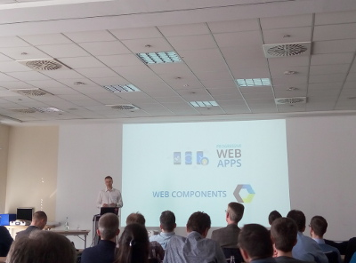
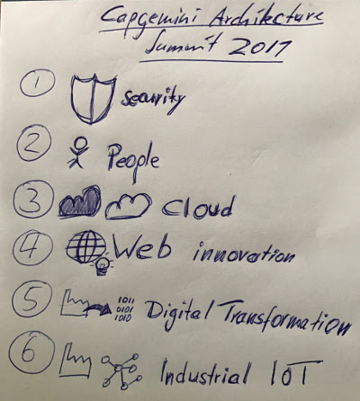
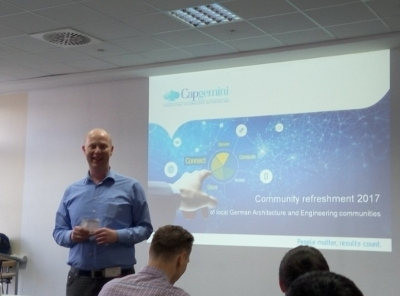
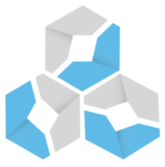
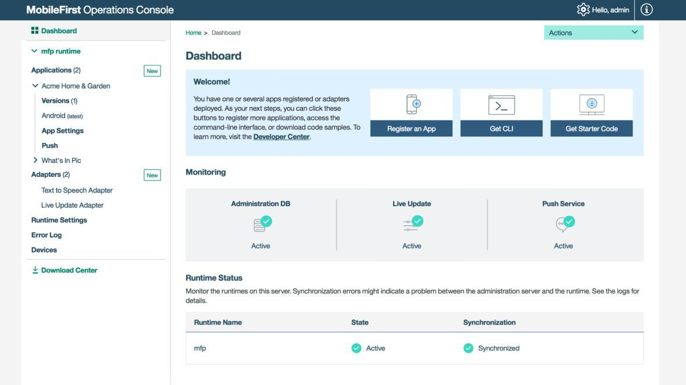

# we-dev-on newsletter; TARGET DATE edition 29th of March 2017

## Introduction

Dear devonfw community,

We present the second edition of the 'we-dev-on' newsletter, the reader-supported publication for and from the devonfw & OASP communities all over Capgemini APPS2. This does not mean that the newsletter will be published biweekly. There is no rush - we publish when ready - but we are happy to conclude and to report that there are enough new news items which warrant this new edition. 

The iCSD Core Team

## Devonfw Harvest Status update

As published in [the previous edition of the newsletter](https://devonfw.github.io/we-dev-on/2017/10-03-2017.html) we have launched the initiative of the  **devonfw Harvest**.

This is meant to be an agile process wherein the engagements do not have to change their client focused approach. They implement their modules and components in the interest of and within the context of the project. However, we offer them the opportunity to contribute their work within devonfw by participating in "the Harvest". During these events, basically **hackathons**, members of the devonfw and OASP communities help volunteers from the engagements "extract" project specific components and turn them into more generic modules which can be used by any future engagement from all over APPS2. By participating in a Harvest, those involved in the engagements can guarantee the existence of the module in future projects, which is to everyone's advantage, and contribute back to the community; become *part* of that community. And as a teaser we offer a price for the best component for each Harvest. 

We are happy to be able to announce that we **already have received nominations from both Germany as well as Spain**. See the announcements by [Jörg Holleder](https://www.yammer.com/capgemini.com/#/Threads/show?threadId=857052773) and [Manuel Esteve](https://www.yammer.com/capgemini.com/#/Threads/show?threadId=859703316). Thank you all!

The engagements can still put forward their candidate components and teams until **Wednesday the 5th of April**. The next Friday the eligible contenders are announced on Yammer. During the next 5 consecutive Fridays we will organize the webcast where all teams can show off their work. And **Friday the 12th of May 2017** the winning team will be announced.

## Architects- and Software Engineers Summit 2017, Capgemini Germany

This year Capgemini Apps Germany organized their yearly summit for Architects. Knows previously as the AppsEvolve! Summit, this know has been renamed to Architects- and Software Engineers Summit. The summit has had a large impact in the field of industrialization and innovation and in connecting influential people across borders. It has turned into something of a crown jewel for the German Practice, which is looked upon with a certain amount of professional but jovial envy from within the rest of Apps2.

This year the overall topic was **"Digital Transformation"**. During the two and a half days in dozens of sessions the participants looked at Capgemini and our competencies, vision and ambitions for 2017 and how to get there with strong architects and engineering communities. It was a great opportunity to learn, network and expand our horizons. All presentations and associated documentation [can be found at the landing page of the Summit](https://troom.capgemini.com/sites/vcc/Wiki/Summit2017.aspx).

During the second day we had an opportunity to give several short talks about the state of iCSD, devonfw and Production Line, which were well received. [The devonfw slides can be found here.](https://docs.google.com/presentation/d/1m8-L7WFMsxSMEIuGSuHCiyXqQSudffJaZKuPAOnjD6k/edit?usp=sharing). 

All in all, it was a wonderful experience due to a terrific ambiance, people, topics and outcome. And, let's not forget, **great** organisation. Many thanks to **Patricia Trautmann** and **Marco Rose**!

## Cobigen; Webcast & Interview

### The webcast

The **next webcast of the iCSD Series: Stuff That Matters!** will take place on the **7th of April** 10am to 11am CET time (2:30pm to 3:30pm IST). During that talk we will investigate CobiGen as a SDK for your project.

The webcast will focus on:

- a short introduction of CobiGen
- how CobiGen can accelerate your oasp or non-oasp project
- experience reports of existing projects utilizing and adapting CobiGen

We would like to welcome anyone [to join us for the webcast and ask questions.](https://lync.capgemini.com/capgemini.com/meet/malte.brunnlieb/WRQLGBS8)

### An interview with the faces behind Cobigen

Behind the tool there is a real story and real people. We decided to interview then so they can have their deserves place in the spotlight. Who is part of the community making Cobigen?

We have asked the following people some questions:

- Malte Brunnlieb - The founder and lead architect of CobiGen

- Jörg Holwiller  - Managing Consultant. One of the old guard who started OASP as well as devonfw

- Ruben Diaz - Developer. Member of the devonfw core team.

### How would you like to introduce yourself?

**Malte**: I am someone who loves to tackle new ideas and make them real. I love to share my ideas with communities of different shapes. I am an open source enthusiast. I have been speaker on eclipseCon Europe, on different eclipse demoCamps in Germany, as well as on the OOP in Munich with OASP topics. I like traveling and get to know new guys interested in OASP and Devon. I am open-minded. You have a new idea to make things of our daily work even simpler? – let’s discuss it!

**Jörg**:  I am the key founder of OASP and an enthusiastic participant of our Devon iCSD initiative. Further, I am a passionate developer and architect who seeks for continuous improvement of our tools, design-concepts, infrastructure and methodology. Finally, I believe in the power of open-standards, collaboration and community.

**Ruben**: Enthusiastic ‘geek’ and computer engineer in love of the technology and software development world. I consider myself an autodidact developer that sometimes put himself new challenges and goals to much ambitious. I really love research and keep myself informed about new technologies. However, I ended my studies and started my professional way at CapGemini almost a year ago so I still have too much to learn and I am looking forward to.

### What is your principal role in the development in Cobigen?

**Malte**:  I am the founder and lead architect of CobiGen, which has been born with the foundations of my ongoing PhD.

**Jörg**: I am not a key-player in CobiGen but more a happy user of it. As a believer of community and collaboration I share my experience and also my wishes and dreams about this tool. This already makes me part of the game. I end up in discussions about the design of new features and somehow find myself in the middle of a coding session with Malte (our CobiGen-Guru).

**Ruben**: My main role is to research and develop new functionalities for CobiGen as EXT JS and Angular2 client generations including their correspondent templates. This features can include the treatment and mergers of multiple additional languages as HTML and JSON. Not less important is my secondary role, that is to fix bugs or issues on the already implemented functionalities.

### What do you find the most important/attractive/fun part?

**Malte**:  Getting to know new people. Getting to know completely different project contexts other architects are confronted with, but you could not even imagine. Start to build up a network of experts. There is someone around who already faced your issues or requirements. I really love the traveling aspect as a trainer for devon. Work on a vision, fight for your conviction!

**Jörg**: First of all, I think that it is one of our best assets we have for CSD. We all dreamed about MDD and MDA many years ago. These visions did not come true those days. That was actually not because of the visions and concepts themselves but because of the limited tools. Now, after the MDD/MDA hype is over CobiGen silently appears and suddenly the round-trip engineering is working smooth. This is already fun to see.

As CobiGen offers a high gain in efficiency via generation of pattern-based code it is also fun in daily usage. This is because it saves me from the stupid and boring work and lets me concentrate to the more challenging tasks.

Also my coding on CobiGen itself is fun as it is a product-world where you can and have to think further beyond the problems of your current project. Instead you have to see the entire CSD world in front of your mind’s eye. This is a nice challenge for coders who seek for beauty and truth.

**Ruben**: The most attractive and fun part for me is the research process. Implement new functionalities implies research which tools already exists and the way I can use them to achieve the goal. I really love to be continuously learning and knowing new
technologies and all the challenges that their implementations into CobiGen bring.

Referring most important part I would say the coding process itself. It is the first time for me I develop software that other people will use so now I have to code thinking in terms of usability and it’s first time too that I implement code that other developers will maintain so I have to have into account more than ever concepts like efficiency and make the code as understandable as I can.

### Cobigen is a good example of intensive and exclusive usage of distributed/OSS/Github/agile practices. How does that compare to “normal” development in Capgemini?

**Malte**:  Projects at Capgemini recently started to implement agile practices like Scrum Meetings, Sprints, Kanban Boards, etc. Very less projects already start to work in a sophisticated version control system like Git coupled with Merge/Pull Request workflows. The benefits are tremendously especially if projects are staffed across countries and even continents. GitHub is just showing how processes can be easily supported by a good tooling to speed up development and collaboration. I think Capgemini is on track to eventually implement best practices already lived in the Open Source worlds. However, we at Capgemini also should remind our self, that processes just focus on collaboration and standardization. To produce high quality software, we even need the right tools to work efficiently.

**Jörg**: It makes collaboration and contribution a lot easier. Unlike OASP you have to get access granted once but that is pretty much it. If you are interested in having a look, just write an email with your github account and request access for tools-cobigen repository and get started J

**Ruben**: I started at CapGemini working with CobiGen, so I really don’t know enough the normal development to compare with.

### Does it scale well?

**Malte**:  Also on GitHub communities and repositories, scaling is highly coupled with the level of quality you want to assure. As you get standardized processes of development supported and somehow enforced by the tooling itself, you cannot circumvent it easily if you have not the permissions to do so. In today’s projects you will have such situations, where code is less reviewed or simply wrongly integrated to finally match deadlines. To build up hurdles by tooling will decrease scalability especially with large groups of developers, but it can increase quality extraordinary if lived.

**Jörg**: IMHO yes. We have not yet masses of developers contributing to Devon/OASP. Technically I believe it scales perfect. The only thing that does not scale are the resources required to do the reviews if thousands of Capgemini employees would start making contributions. But I am sure that the more projects are using Devon the more feedback and contributions we will receive.

**Ruben**: Currently there is not too much developers contributing to CobiGen, so for the moment it has a good scalability due to the usage of GitHub itself. However, I think that the quality of the work can be compromised in some cases as sometimes I can’t be aware of new changes done by another developer until them are merged into the repository, so I faced situations in that my current feature in development or already developed fails with the last update. This can be due to the fact that, sometimes, the code cannot be fully reviewed and/or tested before integrate it.

### How would you envision Cobigen – potentially – to be able to grow (NOT the official roadmap)

**Malte**:  CobiGen is only the tip of the iceberg. My next vision is to specify architectures in a pattern based way. These patterns can be input for CobiGen to generate code as we already see by the notion of increments in CobiGen. The more interesting and envisioned part is, that I also start to recover the same patterns from existing source code. Thus, CobiGen gets an understanding of what patterns are already implemented in the code base. Finally, this knowledge can be used to start thinking about simple but effective code transformation techniques. As an example take different logic layer designs we are already facing due to the different complexities in applications. Often you would like to start with a simple logic layer, but if code evolves and you need a refactoring, take CobiGen to transform your code from a detected existing logic layer pattern to a different one!

**Jörg**: CobiGen still has a great potential to Leverage. If you look into the issues and see our plans for generation wizard, advanced batch generation, language agnostic templates, merge support for typescript, honoring @Generated on merge, and many other features I can already see a future where writing templates and using CobiGen gets so much better and we will gain yet another 5-10% of development efficiency. This potential is so great that IMHO we should actually push and challenge CobiGen development even more within iCSD.

**Ruben**: CobiGen has a lot of hidden potential, it can be improved in a lot of ways, the Eclipse wizard, more features, more different language and purposes mergers, add more merge strategies and a very big etcetera. For example it would be a good idea to avoid the specific inputs and use the whole project and using the wizard choose to generate server or the client side and, in this last case, choose between Sencha, Angular2, etc … In conclusion and IMHO, I think that CobiGen should grow in the way of usability a little more.

### Anything to add; please feel free to do so.

**Malte**:  I developed the basis of CobiGen in the early phases of the OASP and the baby grew up to a SDK to serve multiple target languages already. Thanks to already quite a solid foundation of contributors, I am now more the architect behind CobiGen than the main developer anymore. I love to see the community growing and see people just contributing because they are convinced of the idea. Basically, this is not just the case for CobiGen but for the whole devon and oasp community. It is even not possible anymore to be up-to-date on every ongoing development. The commitment of so many colleagues grows and grows. Thanks!

**Jörg**: I only feel like adding more features to CobiGen, but nothing more to this interview J

**Ruben**: I feel comfortable and happy working in CobiGen development. Even if I have to work in other projects I would like to keep linked to it.

## Preview Devonfw Microservices

Microservices is a software architecture approach based on dividing the application in a group of small and independent services, each one of those is related to a business domain, run in its own process and communicate with each other with lightweight mechanisms like, often, HTTP resource API.

Having that separation of _functionalities_ in different services allows to introduce changes in one of those services without affecting the entire application. Thus fixing, updating or scaling one particular service can be done without the necessity of redeploying the whole application. We can find real examples of microservices architectures in popular and high demanded services like [Netflix](http://techblog.netflix.com/), [Amazon](http://highscalability.com/blog/2007/9/18/amazon-architecture.html) or [eBay](http://www.addsimplicity.com/downloads/eBaySDForum2006-11-29.pdf).

To make it easier for Devonfw users to design and develop applications based on microservices, next Devonfw release will provide a series of archetypes and resources to automate the creation of the needed components, pre-configured and ready to start working.

As microservices implementation, [Spring Cloud Netflix](http://cloud.spring.io/spring-cloud-netflix/) provides [Netflix OSS](https://netflix.github.io/) integrations for _Spring Boot_ apps through autoconfiguration and binding to the Spring Environment.

Based on _Spring Cloud Netflix_, next Devonfw release will offer microservices archetypes and a complete user guide with all the details to start creating microservices with Devonfw. You can find more details of _Spring Cloud Netflix_ components [here](http://cloud.spring.io/spring-cloud-static/spring-cloud-netflix/1.3.0.M1/).

New Devonfw components:

- microservices infrastructure archetype: generates all the _Spring Cloud Netflix_ preconfigured projects to provide all the components of the microservices architecture.

  - routing service, the entry point of the app (_Zuul_)

  - service discovery, to register and locate the microservices (_Eureka_).

  - auth service (based on [jwt](https://jwt.io/))

- microservice archetype: generates a microservice project pre-configured to be used with the _Spring Cloud Netflix_ infrastructure.

- user guide: The Devonfw guide will have a new section with all microservices details. You can see a preview [here](https://github.com/devonfw/devon-guide/wiki/devon-microservices) and [here](https://github.com/devonfw/devon-guide/wiki/Client-GUI-Sencha-with-devonfw-microservices).

## Italian Mobile Project Support

Since last November, the Devonfw Core Team collaborates with the **Italy Hera Team** in order to build a common development environment based on **Ionic 2 and Angular 2** for mobile apps, which is compatible and integrated with **IBM Mobile First Platform 7.1**. 

This collaboration consist of two main points:

1. The definition and development of an Ionic 2 kickstarter application integrated in the mentioned platform.
1. The extension of the Devonfw Cobigen generator to create Angular 2 & Ionic 2 applications. 

One of our experts in Angular 2 and Ionic 2 I was in charge to get the first point done and to monitor the development of the second one.

We had to get on board of the IBM Mobile First platform and resolve the issues related to compatibility between versions and technologies, as this platform and Ionic are evolving very fast. After some research and hard work the team got this kickstarter app working fine in the IBM platform, so we could show the results in one of our weekly Skype meetings. Afterwards, we helped during the starting phase of the development of the first PoC that our italian colleagues wanted to develop in order to be able to master Ionic 2 development.

After a few weeks the italian team showed us the first Ionic 2 application over the IBM Mobile First platform with a lot of powerful features. It was a great job, well done!

Our collaboration will continue into the next months, as the Italian Team will embrace the new IBM Mobile First platform version next summer, which is closer to the current frontend and mobile development. 

## Release Notes devonfw for Linux 2.1.1

We have released Devonfw Linux version 2.1.1 on Friday the 24th of March 2017.  This is an update or patch release - still considered to be within the scope of "Balu".

The Devonfw Linux 2.1.1 distro can be [dowloaded from Teamforge](https://coconet.capgemini.com/sf/frs/do/downloadFile/projects.apps2_devon/frs.devon_distribution.2_1_1/frs57461?dl=1).

This version does not include Devcon as it is going to be made compatible with Linux in the next final release. Please read the new improvements of 2.1.1 version [in this post.](https://www.yammer.com/capgemini.com/#/Threads/show?threadId=841389146&search_origin=global&scoring=linear1Y-prankie-group-private-higher&match=any-exact&search_sort=relevance&page=1&search=distribution%20release)

## Contributors

Many thanks to XXXX and anyone who we may have forgotten to add!

## Colophon

we-dev-on is a reader-supported publication dedicated to producing the best coverage of project info, opinions, news, events, tips & tricks from within the devonfw & OASP communities all over Capgemini APPS2.

Copyright © 2017 Capgemini
Licensed under the Apache License, Version 2.0
