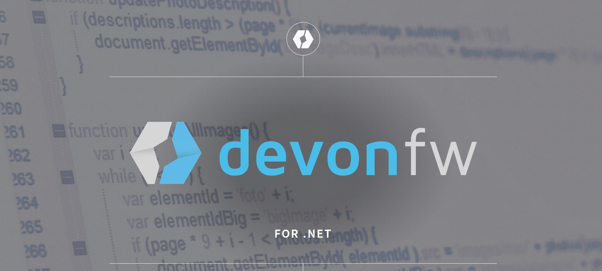
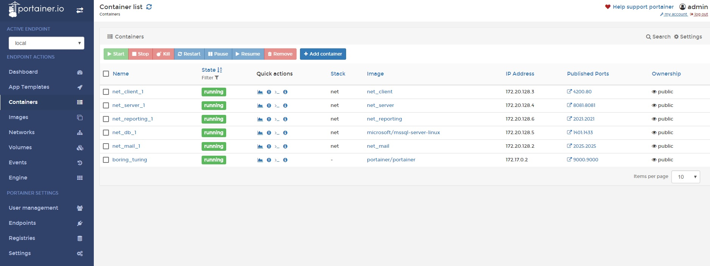
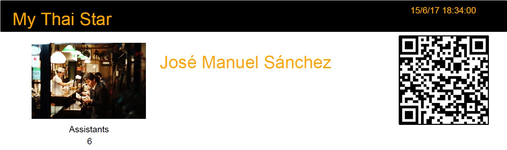
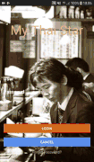

## Introduction

OASPOASP4NET/X is aimed to increase the technology stack of devonfw with .NET ecosystem.

OASP4NET (.NET and .NET Core) and OASP4X (Xamarin) are  Microsoft's technologies that day by day are becoming more and more popular offering solutions in diferent scopes such microservices, app development (iOS/Android/UWP) and desktop development. 

Now all of these scenarios take part in devonfw. It is real. It works.

## What is OASP4NET?

As part of devonfw OASP4NET and OASP4X increase the technology stack with .NET support. 

OASP4NET (.NET Framework 4.6+ and .NET Core 2.0+) aims to bring support of backend development through good practices and standards from Microsoft. 

OASP4NET provides a bundle with a full set of features and documentation. We can find in the bundle:

- Documentation 
&nbsp;&nbsp;&nbsp;&nbsp;&nbsp;&nbsp;Documentation in HTML format to help developers in a easy way.

- Samples 
&nbsp;&nbsp;&nbsp;&nbsp;&nbsp;&nbsp;Different samples to show how to use templates with complex functionality such Google API integration, reporting services...

- Templates 
&nbsp;&nbsp;&nbsp;&nbsp;&nbsp;&nbsp;.NET Framework 4.6 and .NET Core 2.0+ multiplatform templates are provided with JWT security, swagger integration, serilog, selfhost (Kestrel), Entity Framework Core, Docker ready and more features.
- My Thai Star .NET backend implementation  
&nbsp;&nbsp;&nbsp;&nbsp;&nbsp;&nbsp;My Thai Star backend full implementation with the same contract than Java backend and microservice ready.

Working with OASP4NET helps to create .NET solutions easy and fast. Also, all the source code provided can run on Linux, iOS and Windows. 

It's important to point out that OASP4NET is ready to be run on linux docker images. All components provided work well on this hosts. My Thai Star sample is designed and developed to run as microservices on docker architecture. Docker files and docker compose are provided in the sample to give a full working show case.

## What is OASP4X?

OASP4X (Xamarin) provides to .NET developers the ability to design and create mobile applications (desktop applications too). Also, OASP4X brings the Excalibur framework (based on MVVMCross) from The Netherlands to devonfw in order to achieve this goal.

Excalibur provides some useful abstractions like device IO management, dependency injection and automapping. 

OASP4X provides the My Thai Star showcase application using Excalibur + XForms. XForms approach lets the application to be run on iOS, android and UWP devices with one UX design. Write once, deploy anywhere.

## My Thai Star on OASP4NET/X

My Thai Star Sample application has been ported to .NET stack using OASP4NET/X.

- The backend 
&nbsp;&nbsp;&nbsp;&nbsp;&nbsp;&nbsp; My Thai Star on .NET has been designed to work on premise, on cloud or docker Linux images. That means that all given projects are ready to run on different platforms such Windows, Linux or iOS.

&nbsp;&nbsp;&nbsp;&nbsp;&nbsp;&nbsp;&nbsp;&nbsp;&nbsp;&nbsp;&nbsp;&nbsp; The implementation contains:  

&nbsp;&nbsp;&nbsp;&nbsp;&nbsp;&nbsp;&nbsp;&nbsp;&nbsp;&nbsp;&nbsp;&nbsp;&nbsp;&nbsp;&nbsp;&nbsp;&nbsp;&nbsp; - The main application  

&nbsp;&nbsp;&nbsp;&nbsp;&nbsp;&nbsp;&nbsp;&nbsp;&nbsp;&nbsp;&nbsp;&nbsp;&nbsp;&nbsp;&nbsp;&nbsp;&nbsp;&nbsp;&nbsp;&nbsp;&nbsp;&nbsp;&nbsp;&nbsp;Implements the same contract as Java Backend 

&nbsp;&nbsp;&nbsp;&nbsp;&nbsp;&nbsp;&nbsp;&nbsp;&nbsp;&nbsp;&nbsp;&nbsp;&nbsp;&nbsp;&nbsp;&nbsp;&nbsp;&nbsp; - The email microservice  

&nbsp;&nbsp;&nbsp;&nbsp;&nbsp;&nbsp;&nbsp;&nbsp;&nbsp;&nbsp;&nbsp;&nbsp;&nbsp;&nbsp;&nbsp;&nbsp;&nbsp;&nbsp;&nbsp;&nbsp;&nbsp;&nbsp;&nbsp;&nbsp;The microservice is able to send email from html templates in order to confirm the user actions. 

&nbsp;&nbsp;&nbsp;&nbsp;&nbsp;&nbsp;&nbsp;&nbsp;&nbsp;&nbsp;&nbsp;&nbsp;&nbsp;&nbsp;&nbsp;&nbsp;&nbsp;&nbsp; - The reporting server microservice  

&nbsp;&nbsp;&nbsp;&nbsp;&nbsp;&nbsp;&nbsp;&nbsp;&nbsp;&nbsp;&nbsp;&nbsp;&nbsp;&nbsp;&nbsp;&nbsp;&nbsp;&nbsp;&nbsp;&nbsp;&nbsp;&nbsp;&nbsp;&nbsp;The microservice is able to generate PDF reporting files with QR image embebed and database access from template files.   

&nbsp;&nbsp;&nbsp;&nbsp;&nbsp;&nbsp;&nbsp;&nbsp;&nbsp;&nbsp;&nbsp;&nbsp;&nbsp;&nbsp;&nbsp;&nbsp;&nbsp;&nbsp;&nbsp;&nbsp;&nbsp;&nbsp;&nbsp;&nbsp;On My Thai Star restaurant now we are ready to send the invitations with QR code! 

- The frontend 
In order to show the OASP4X capabilities My Thai Star sample application is provided (iOS/Android ready). The application connects to .NET/Java backend without restrictions and the user interface is designed with XForms. 

At the moment My Thai Star Xamarin port is under development. 

